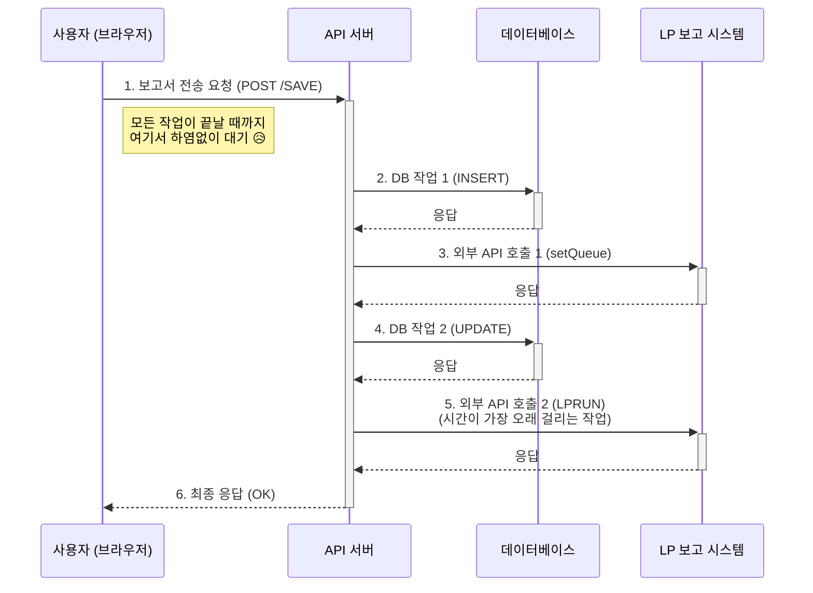
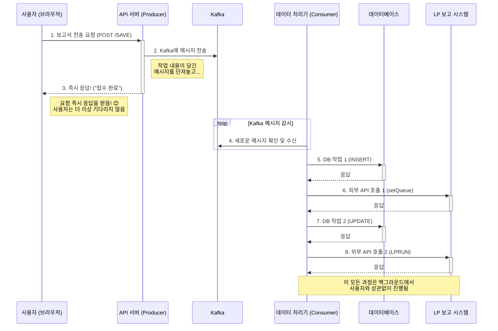

# Kafka를 이용한 동기 시스템의 비동기 전환 PoC

## 1. 프로젝트 동기

재직중인 회사의 '전자 보고 관리 시스템'은 사용자가 데이터 전송을 요청할 때, 관련된 모든 처리가 **동기(Synchronous)** 방식으로 동작하여 병목 현상이 발생하고 있습니다. 이 토이 프로젝트는 실제 운영 시스템에 **Kafka 를 적용하기에 앞서, 기술적인 타당성을 검증하고 개선 효과를 미리 확인하기 위한 Proof of Concept(PoC)** 입니다.

## 2. 문제 상황: 현재 시스템 (As-Is)

- **느린 응답 속도**: 사용자가 '보고 전송'을 요청하면, API 서버는 DB저장, 여러 번의 외부 시스템 API 호출 등 모든 작업이 끝날 때까지 대기해야만 응답을 줄 수 있습니다.
- **시스템 전체 부하**: 여러 사용자가 동시에 요청할 경우, 서버의 스레드가 모두 긴 작업에 묶여 시스템 전체가 느려지고 장애에 취약해지는 문제가 있습니다.

## 3. 제안 해결 방안 (To-Be)

API 서버와 실제 데이터 처리 시스템을 **Kafka를 통해 분리** 하여 비동기 아키텍처로 전환합니다.

- **(Producer) API 서버**: 사용자의 요청을 받으면 필수 데이터만 담아 Kafka에 메시지로 전송하고, 즉시 '접수 완료' 응답을 보냅니다.
- **(Consumer) 데이터 처리기**: Kafka로부터 메시지를 받아, 시간이 걸리는 실제 작업들(DB 저장, 외부 API 호출 등)을 백그라운드에서 순차적으로 처리합니다.

## 4. 기대 효과 (PoC를 통해 검증하려는 것)

1. **API 응답 속도의 획기적인 개선**
2. **시스템 안정성 확보 및 장애 격리** (Consumer 장애가 API 서버에 영향을 주지 않음)
3. **확장 가능한 아키텍쳐 설계 검증** (요청량이 많아지면 Consumer만 증설하여 대응 가능)
